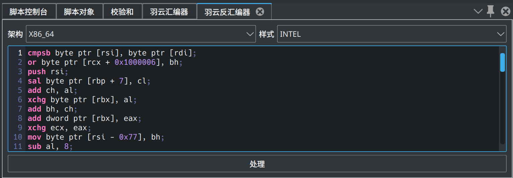

<h1 align="center">WingHexExplorer2.WingAsm</h1>

WingAsm

- 开源不易，给个 Star 或者 [捐助](#捐助) 吧

## WingHexDisasm

&emsp;&emsp;`WingHexAsm`是一个羽云十六进制编辑器插件，它具有汇编和反汇编的能力，基于`keystone`和`capstone`引擎框架。

### 协议

&emsp;&emsp;本插件仓库将采用`AGPL-3.0`协议，不得将该插件代码用于改协议之外的用途。

## 效果图

WingAsm

## 捐助

> If you are not Chinese, you can use [Afadian](https://afdian.com/a/wingsummer) to support me.

**
您的每一份支持都将是本项目推进的强大动力，十分感谢您的支持
**

感谢支持

