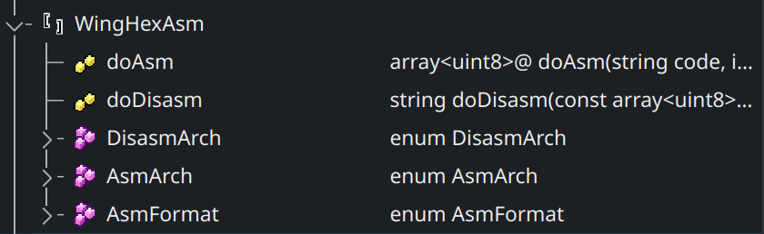
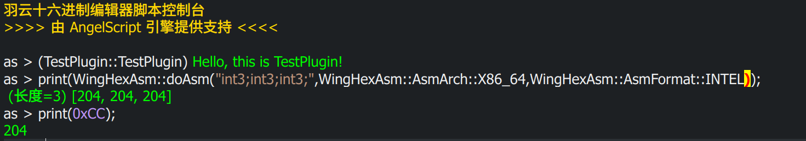

<h1 align="center">WingHexExplorer2.WingAsm</h1>

<p align="center">

<p align="center">WingAsm</p>
</p>

<p align="center">


</p>

- 开源不易，给个 Star 或者 [捐助](#捐助) 吧

## WingHexDisasm

&emsp;&emsp;`WingHexAsm`是一个羽云十六进制编辑器插件，它具有汇编和反汇编的能力，基于`keystone`和`capstone`引擎框架。

### 协议

&emsp;&emsp;本插件仓库将采用`AGPL-3.0`协议，不得将该插件代码用于协议之外的用途。

## 说明

&emsp;&emsp;以下是对该插件情况的一些说明：

1. 汇编高亮仅支持 x86_64 / MIPS / ARM64 / PowerPC ，如果需要支持其他的请 PR，因为我使用的也就是 x86_64 多一些，所有的高亮汇编都是是查文档整理的。
2. 汇编指令繁多，所以高亮的结果也可能不全，欢迎 PR 补充。
3. 目前该插件语言仅支持简体中文和繁体中文（繁体中文使用工具转化），如果支持其他语言可 PR 。
4. 如果该插件不支持一些架构，但`keystone`和`capstone`里面有，欢迎 PR 。

&emsp;&emsp;该插件提供了两个服务：

```cpp
WING_SERVICE QPair<QByteArray, int> doAsm(const QString &code, int arch,
                                          int format);
WING_SERVICE QPair<QString, int> doDisasm(const QByteArray &code, int arch,
                                          int format);
```

&emsp;&emsp;前者是汇编函数，后者是反汇编函数。`arch`和`format`是两类枚举；`doAsm`的`arch`和`doDisasm`的`arch`分别对应`WingEngine::KSArch`和`WingEngine::CSArch`。`format`对应`WingEngine::AsmFormat`。如果你实在记不住枚举值，你可以拷贝里面的内容，注意保持和插件版本一致。

&emsp;&emsp;与此同时，插件也提供了脚本服务：

<p align="center">

</p>

&emsp;&emsp;前两个是分别对应的函数。同时注册了三个枚举以提高可读性，`WingEngine::KSArch`和`WingEngine::CSArch`分别对应`AsmArch`和`DisasmArch`。

&emsp;&emsp;如下是脚本函数使用示例：

<p align="center">

</p>

## 效果图

<p align="center">

<p align="center">WingAsm</p>
</p>

## 捐助

> If you are not Chinese, you can use [Afadian](https://afdian.com/a/wingsummer) to support me.

**<p align="center">您的每一份支持都将是本项目推进的强大动力，十分感谢您的支持</p>**

<p align="center">


<p align="center">感谢支持</p>
</p>
